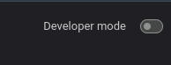
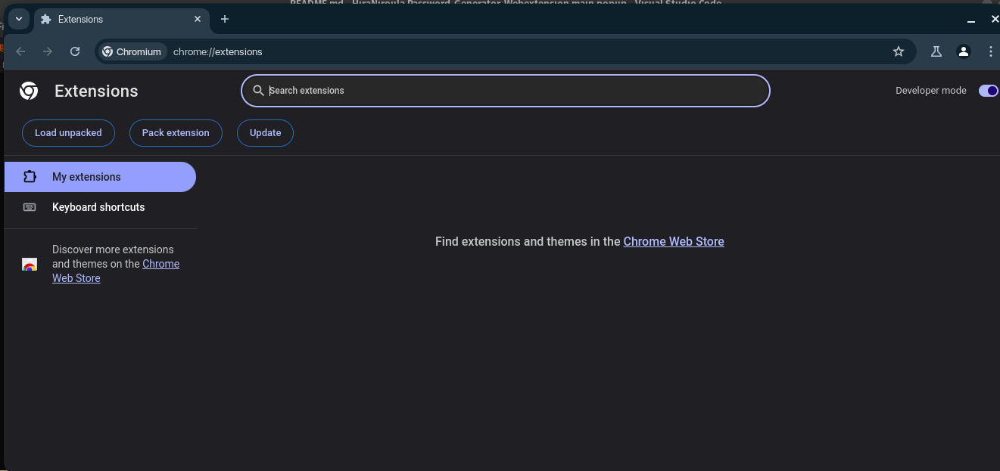
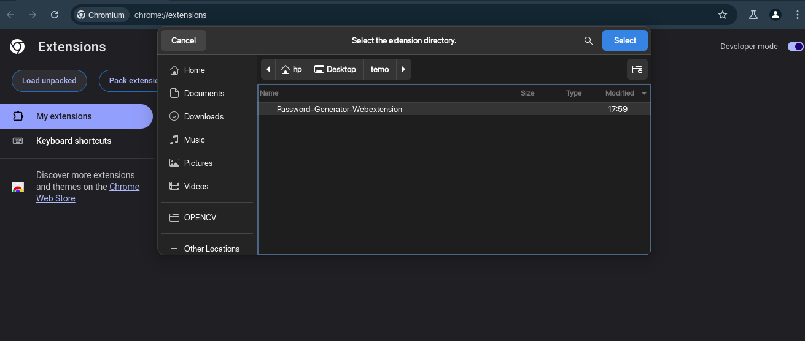
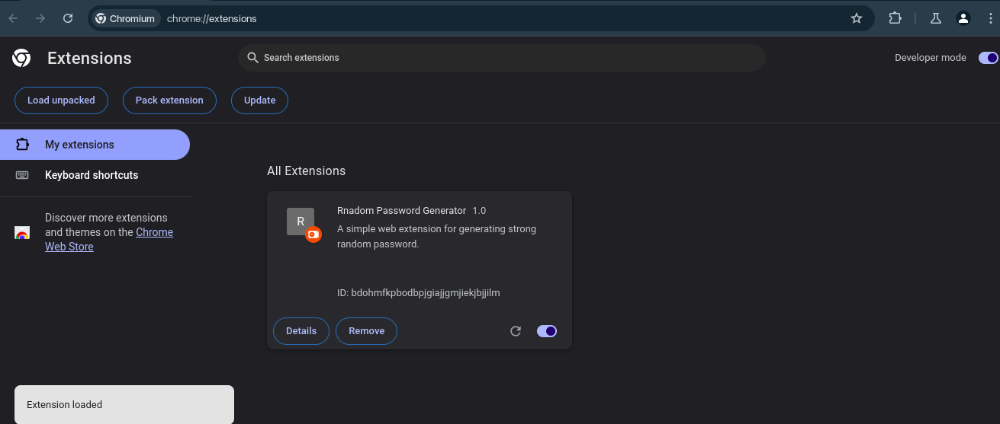
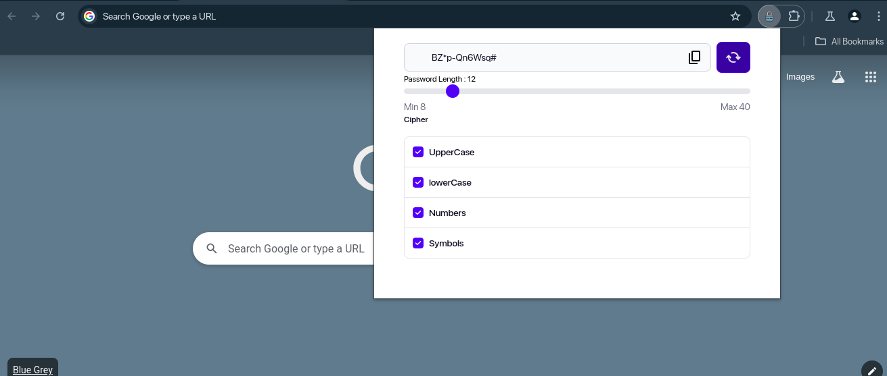

# Password-Generator-Webextension

> A simple Web extension that generate a random password according to user parameter.

## To Test
- Clone the repo using `git clone` command
- Go to extensions on chrome `chrome://extensions/`
- Enable developer mode

- Select Load Unpacked

- Select the repo folder 

- Click Select

- You are now ready

